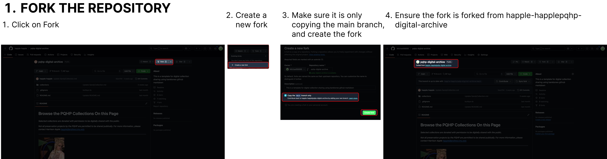
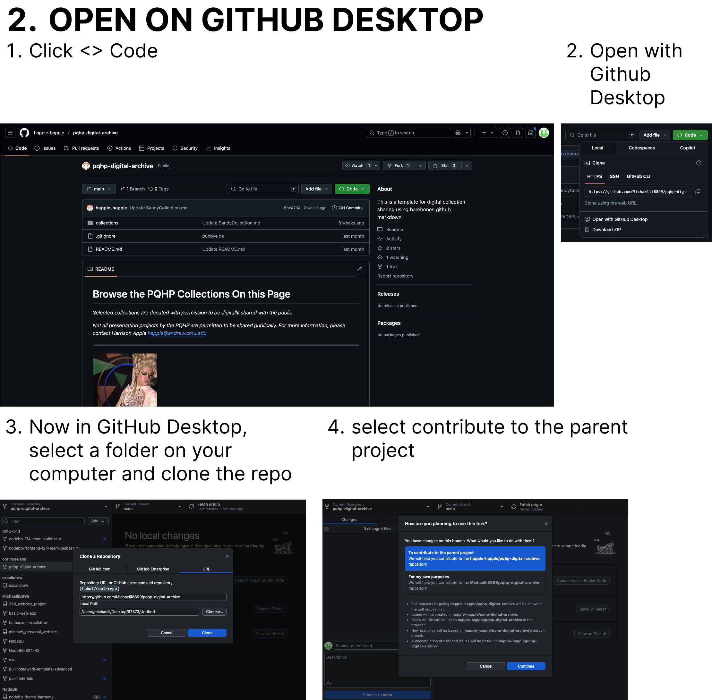
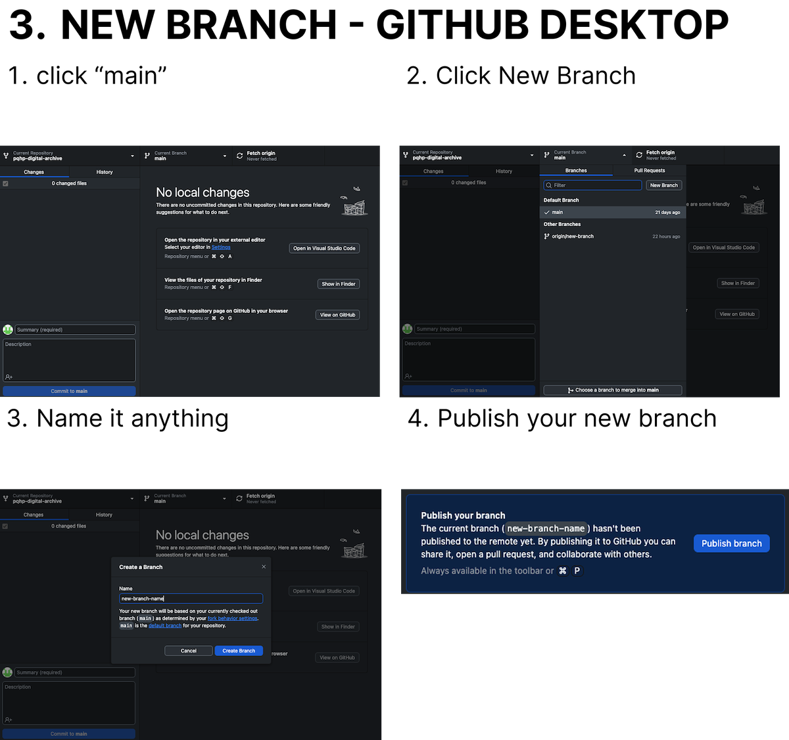
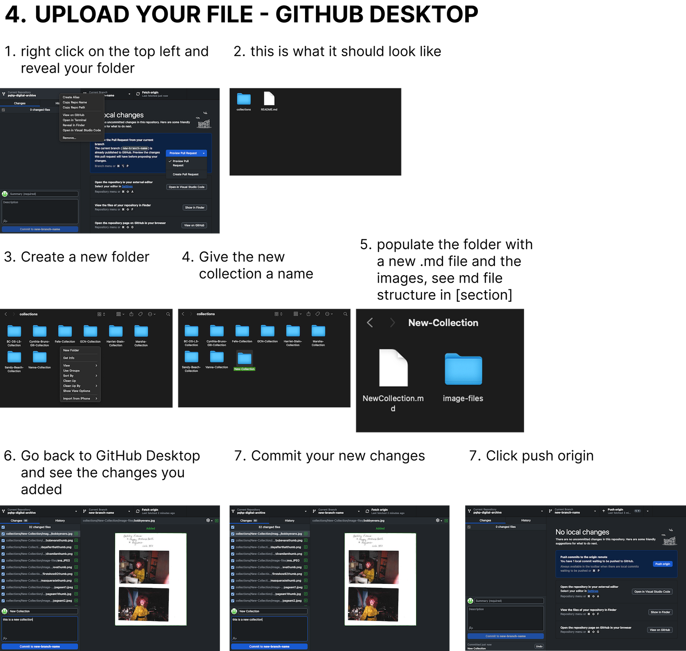
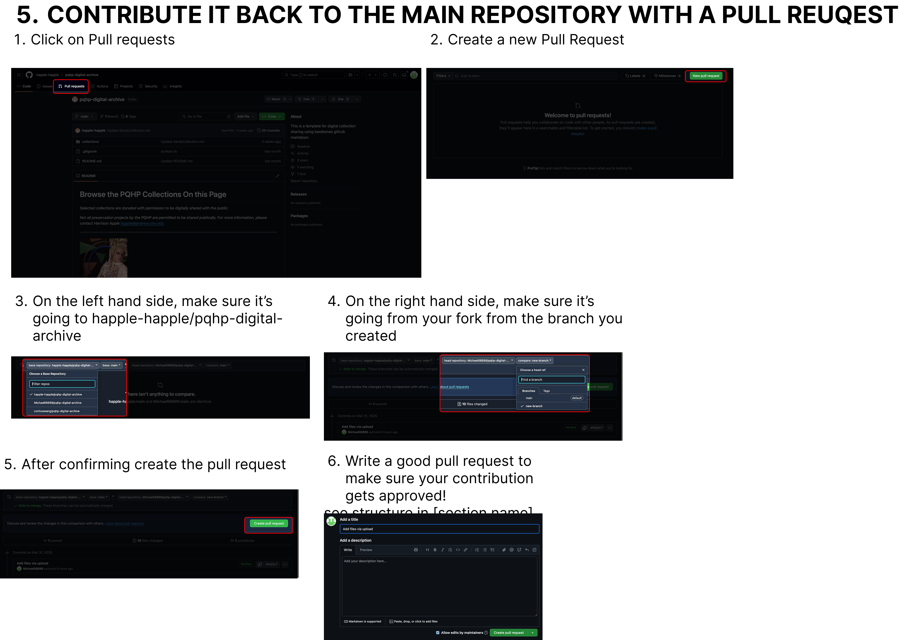

# Contribution Guide for [PQHP Digital Archive](https://github.com/happle-happle/pqhp-digital-archive)

This is a beginner-friendly guide for contributing to the **PQHP Digital Archive** project using **GitHub Desktop** and the GitHub web interface. **No coding experience required.**

---

## Step 0: Install GitHub Desktop

1. Sign in with your GitHub account. If you don’t have one, register at [https://github.com](https://github.com).
2. Download GitHub Desktop from [https://desktop.github.com](https://desktop.github.com).
3. Install and open GitHub Desktop.

---

## Step 1: Fork the Repository

1. Visit the project repository: [https://github.com/happle-happle/pqhp-digital-archive](https://github.com/happle-happle/pqhp-digital-archive)
2. Click the **"Fork"** button in the top-right corner.
3. GitHub will create a copy under your account:  
   `https://github.com/your-username/pqhp-digital-archive`

---

## Step 2: Clone the Repository Using GitHub Desktop

1. In your browser, go to your **forked repository**.
2. Click the green **"Code"** button, then choose **"Open with GitHub Desktop"**.
3. GitHub Desktop will prompt you to choose a folder on your computer.
4. Click **"Clone"** to download the project locally.

---

## Step 3: Create a New Branch

1. In GitHub Desktop, go to the top left where it shows the current branch.
2. Click it and select **"New Branch"**.
3. **Name your branch** (e.g. `add-photo-collection`) and click **Create Branch**.
4. GitHub Desktop will switch to your new branch automatically.

---

## Step 4: Add or Edit Files

1. Open the folder on your computer using Finder/File Explorer.
2. Add your files to the appropriate folder:
   - Images  
   - Markdown content (text)
3. Go back to GitHub Desktop. You’ll see a list of file changes.
4. At the bottom left, write a short **commit summary** (e.g. “Added photos from 1990s”).
5. Click **"Commit to [your branch]"**.
6. After committing, click **"Push origin"** in GitHub Desktop (top bar).7. This uploads your changes to your GitHub fork online.

---

## Step 5: Submit a Pull Request (PR)

1. Visit your fork on GitHub (e.g. `https://github.com/your-username/pqhp-digital-archive`).
2. GitHub will show a **“Compare & pull request”** button — click it.
3. Confirm:
   - Base repository: `happle-happle/pqhp-digital-archive`  
   - Base branch: `main`  
   - Compare branch: your new branch
4. Add a clear title and description of your contribution.
5. Click **"Create pull request"**.
6. Wait for Harrison’s review. Expect one week for a response.

---

## Step 6: Respond to Review Feedback

- PQHP may request changes to your pull request.
- Go to your pull request page and review the comments.
- If needed, update files locally and commit them in GitHub Desktop.
- Click **Push origin** again to update your pull request.

---

## Step 7: Merge Your Changes

- Once your pull request is approved, Harrison or a maintainer will merge it. After merging, your changes will be part of the main project.

---

## Step 8: Sync Your Fork (Optional but Recommended)

- To keep your fork up to date, open GitHub Desktop.
- Click **Fetch origin** and then **Pull** to get the latest updates.
- If necessary, repeat Steps 2–6 for future contributions.

---
