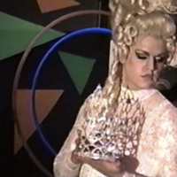
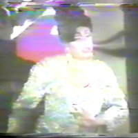
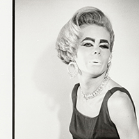
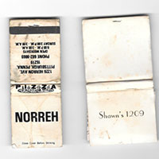
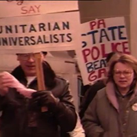
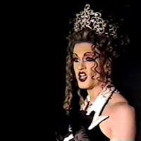
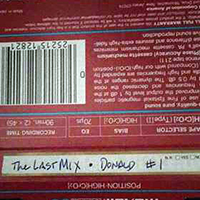
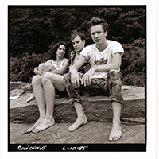
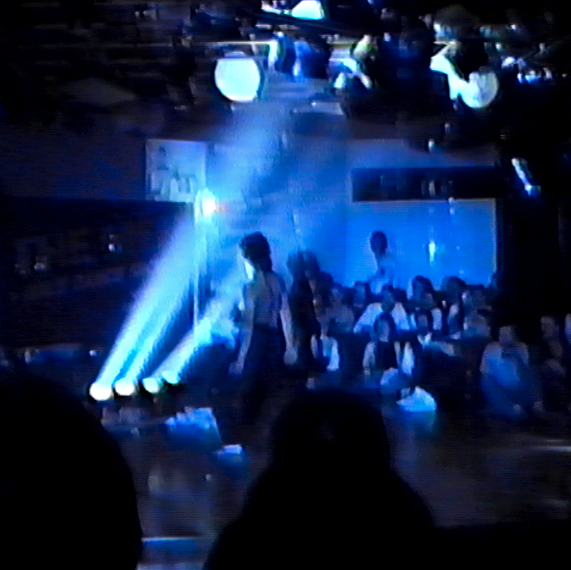

# Browse the PQHP Collections On this Page

## What is PQHP Digital Archive?
Welcome to the PQHP digital archives page! Here, you will find selected archives organized into collections that have been donated with the permission to be digitially shared with the public. 

*Selected collections are donated with permission to be digitally shared with the public. Note all preservation projects by the PQHP are permitted to be shared publically. For more information, please contact Harrison Apple happle@andrew.cmu.edu*

## How to Use?

Each collection is housed within the collections folder above and is organized by contributors. Below are a sample of some of the featured collections with their descriptions. Feel free to browse through all collections within the collections folder! 

*If you would like to contribute to this repo or donate archives to PQHP, please read "Contribution_Workflow" in this repo or reach out to Harrison Apple at happle@andrew.cmu.edu*

---

### [Vanna (aka Michael Obusek) Collection](./collections/Vanna-Collection/Vanna-Description.md)

Michael “Vanna” Obusek (b. July 10, 1966) is former staff of the Travelers Social Club and the Pegasus nightclub where he worked both on and off stage as a bartender, house manager, show director and drag performer between 1986 and 1999. Michael had moved to Pittsburgh from his hometown of Elizabeth, PA, at the age of 18 in search of a gay scene in city. After surviving a liquor control raid at the Traveler’s Social Club in 1986 and testifying to protect the club during a subsequent trial, Michael was offered a job as a bartender, beginning the next decade of his life in the bar business and club culture. When a workplace accident forced him to quit his position at Travelers, former co-workers helped him transition to Pegasus, where he stayed until leaving the bar scene permanently to pursue degrees in interior design and education in 1999... [Read More](./collections/Vanna-Collection/Vanna-Description.md)

---

### [Marsha Monster Mellow Collection](./collections/Marsha-Collection/Marsha-Description.md)

Marsha Mellow Collection contains tapes and documents from the Pittsburgh nightlife scene with emphasis on drag shows at Pegasus Lounge located at 818 Liberty Avenue in Downtown Pittsburgh. Marsha (aka Mark Wilkes) had come of age in the Pittsburgh gay nightclub, becoming a fixture in bar productions as well as regional pageants. Her own tape collection covers stage productions, benefit shows, and bar shows that help illustrate the DIY queer and gay drag cabaret scene in the city, entangled with local on-the-ground activism from AIDS awareness and public health efforts to youth programs like Growing Alterative Youth who were key in creating a space for minors in an otherwise adult-exclusive entertainment scene...[Read More](./collections/Marsha-Collection/Marsha-Description.md)

---

### [Sandy Beach Collection](./collections/Sandy-Beach-Collection/Sandy-Beach-Description.md)

Sandy Beach is an interior designer from Pittsburgh, Pennsylvania, who was also active as a model and drag performer through the 1980s and 1990s including the title of runner up for Miss Pittsburgh 1988. Known for her mid century fashion and makeup, she was frequently hired to perform as a model for the growing vintage market in Pittsburgh, inlcuding advertising for the Ellsworth Avenue boutiques "Eons" and "Hey Betty!"...[Read More](./collections/Sandy-Beach-Collection/Sandy-Beach-Description.md)

---

### [Cynthia Bruno-Gill Collection](./collections/Cynthia-Bruno-Gill-Collection/Cynthia-Bruno-Gill-Description.md)

This collection consists of materials donated by Cindy Bruno-Gill after participating in a series of oral history interviews with Harrison Apple about her life in the massage parlor business in Pittsburgh Pennsylvania. The materials (a shirt and matchbook from the Norreh Social Club in Polish Hill, and a matchbook from Shawn's in Uptown) reflect her patronage of specific lesbian bar spaces in Pittsburgh, as well as the social world she became connected to through her relationship and later marriage to Dante "Tex" Gill. ...[Read More](./collections/Cynthia-Bruno-Gill-Collection/Cynthia-Bruno-Gill-Description.md)

---
### [Gay Cable Network Collection](./collections/GCN-Collection/GCN-Description.md)

This collection contains digitized video contributed by Pam Lewis, producer of the Gay Cable Network program (late 1980s) for Pittsburgh Cable Television (PCTV21). The Gay Cable Network was a local program featuring original content covering gay and lesbian artists, political actions, and social events. The seven tapes in this collection include fashion shows, organization interviews, direct-actions, protests, press conferences, and performance art across Pittsburgh.
The donated footage includes both edited and in-progress works, often with varying events recorded on one tape or across multiple tapes. The Gay Cable Network was made possible by a grant from Lambda Foundation of Pittsburgh, a nonprofit 501c3 Gay and Lesbian charity funded by a seed investment from the Pittsburgh Tavern Guild...[Read More](./collections/GCN-Collection/GCN-Description.md)

---

### [The Dame Fefe Damiana D'Opulence Collection](./collections/Fefe-Collection/Fefe-Description.md)

The Dame Fefe Damiana D'Opulence collection contains digital copies of photographs and VHS tapes, collected by Fefe, that document her career as a drag performer in West Virginia, Pennsylvania, and Washington D.C. As mother of the House of Opulence, Fefe's collection also offers a glimpse into the growth of the drag house during the 1990s through pageants, benefits, and weekly shows at a network of bars and clubs that regularly hosted drag performers across the mid-atlantic and mid-west regions of the US. The still photographs were scanned by Fefe D'Opulence and tape digitization was done by Harrison Apple of the PQHP...[Read More](./collections/Fefe-Collection/Fefe-Description.md)

---

### [The Brian Czarniecki, Donald Sheffey, and Larry Seaman Mixtape Collection](./collections/BC-DS-LS-Collection/BC-DS-LS-Description.md)

These 12 mixtapes were made by DJs Donald Sheffey and Larry Seaman respectively during their time at Zack’s Fourth Avenue in Downtown Pittsburgh. Though many DJs in Pittsburgh made tapes to sell to supplement the low rate offered by most clubs, the tapes in this collection were made specifically for in-house use, usually played early in the night before the crowds arrived. The tapes were collected and preserved by Brian Czarniecki, lightboard operator for Zack’s Fourth Avenue, and lent for digitization to become part of the Pittsburgh Queer History Project archives..[Read More](./collections/BC-DS-LS-Collection/BC-DS-LS-Description.md)

---

### [The Harriet Stein Collection](./collections/Harriet-Stein-Collection/Harriet-Stein-Description.md)

This collection contains personal items illustrating parts of her life in the punk, lesbian, and radical political scene in Pittsburgh from the 1970s to the present. Items include physical ephemera documenting the voter outreach conducted by Harriet as a member of the Gertrude Stein Political Club of Greater Pittsburgh, as well as her punk poster/newsletter collection pulled from Pittsburgh telephone polls..[Read More](./collections/Harriet-Stein-Collection/Harriet-Stein-Description.md)

### [The Vince Lewandowski Collection](./collections/Vince-Lewandowski-Collection/Vince-Lewandowski-Description.md)

Vince Lewandowski is an educator in the Pittsburgh Area with a history of work as the house manager of the downtown dance club "Pegasus" located at 818 Liberty Avenue. Vince's time at Pegasus spanned the 1980s and 90's, working both with the owners of the nightclub as well as managing the club staff and booking entertainment. ..[Read More](./collections/Vince-Lewandowski-Collection/Vince-Lewandowski-Description.md)

--- 

### [Return to Top of Page](#Browse-the-PQHP-Collections-On-this-Page)

### [Return to PQHP Website](https://www.pittsburghqueerhistory.com)
