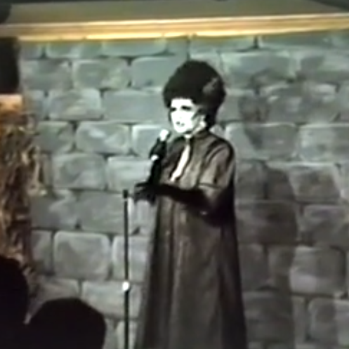
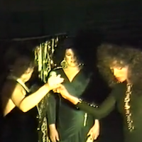

# Pittsburgh Queer History Project

[Return to Main](../../README.md)

## Charles Tierney Collection

*(Chuck Tierney Kisses Chuck Honse on the cheek in their early days at the Venture Inn, 923 Liberty Ave Downtown Pittsburgh)*

### Collection Description
The collection contains photographs, publications, and ephemera produced broadly for the LGBT population of Pittsburgh from the 1980s to the 1990s with an emphasis on documentation of social events tied to gay owned and operated bars. These materials were collected by Chuck Tierney as a bar patron, employee, and owner.

Charles “Chuck” P. Tierney (b. March 29, 1948 – d. October 11, 2017) was a gay business owner and community organizer in Pittsburgh Pennsylvania. With his partner Chuck Honse, he owned and operated the Holiday Bar in Oakland for over 40 years, along with New York, New York (now 5801 in Shadyside) Images Bar (Downtown), The Fourth Avenue Stock Exchange (Formerly Zak’s 4th Avenue Downtown), and Gilbert’s Restaurant (now the Bloomfield Bridge Tavern in Bloomfield). His role as a business owner extended to the co-founding of the Pittsburgh Tavern Guild, the Golden Triangle Picnic Association, and The Delta Foundation of which he was an emeritus board member until his death. His reputation as a prominent business owner and community figure helped him organize philanthropic efforts including the City Theater AIDS Benefit for the Shepherd Wellness Community, and the 1989 Memory Project quilt display at the Convention Center in Downtown Pittsburgh. 

### Series *(Items within the collection organized by topic or media)*
- [**Series 1: Ephemera**](#series-1-ephemera-items) - This series contains objects created for bar promotions or advertisements, including matches, pins, and cups. It also includes Lambda awards presented to Tierney and his businesses.
- [**Series 2: Photographs**](#series-2-photographs-items) - This series contains photographs of Tierney’s bars, including images of patrons, friends, and remodeling projects.
- [**Series 3: VHS Tapes**](#series-3-vhs-tapes-items) - This series contains videos in VHS format which document performances and pageants at bars in Pittsburgh, some owned by Tierney.
- [**Series 4: Newspapers**](#series-4-newspapers-items) - This series contains copies of newspapers produced for the gay & lesbian community, as well as regional papers such as the Pittsburgh City Paper. Newspapers in this series tend to include stories on events or issues of impact to LGBT communities in the city and nationwide. This materials have not been digitized and are not yet available.
- [**Series 5: Last Call for Holiday Bar**](#series-5-last-call-for-holiday-bar-items) - This series contains memorabilia from the Holiday Bar’s farewell party, “Last Call for Holiday Bar,” held on April 29, 2007. Included are “Last Call for Holiday Bar” notecards on which patrons and employees wrote their memories of the bar and printed e-mails from friends and colleagues who had heard of the bar’s closing.

### Series 1: Ephemera Items

 

 

### Series 2: Photographs Items

**hand written notes accompanying photographs were written by Harrison Apple with Chuck Tierney in 2013**

**Auntie Mame's later Images 965 Liberty Ave, Downtown Pittsburgh**

  

 

**Holiday Bar 4620 Forbes Ave, Oakland Pittsburgh**

    

**NY,NY later "5801" 5801 Ellsworth Ave, Shadyside Pittsburgh**

**Venture Inn 923 Liberty Ave, Downtown Pittsburgh**

### Series 3: VHS Tapes Items

[Custom Video #3 for Images by Blueprint Video 1990](https://vimeo.com/1139149187)

 [Images Halloween 1992](https://vimeo.com/331577610)

 [Images Halloween Undated](https://vimeo.com/276493676)

 [Miss Images 1991](https://vimeo.com/331598215)

### Series 4: Newspapers Items

   
 
 

### Series 5: Last Call for Holiday Bar Items

--- 

[Top of Page](#pittsburgh-queer-history-project)

[Return to Main Directory](../../README.md)
